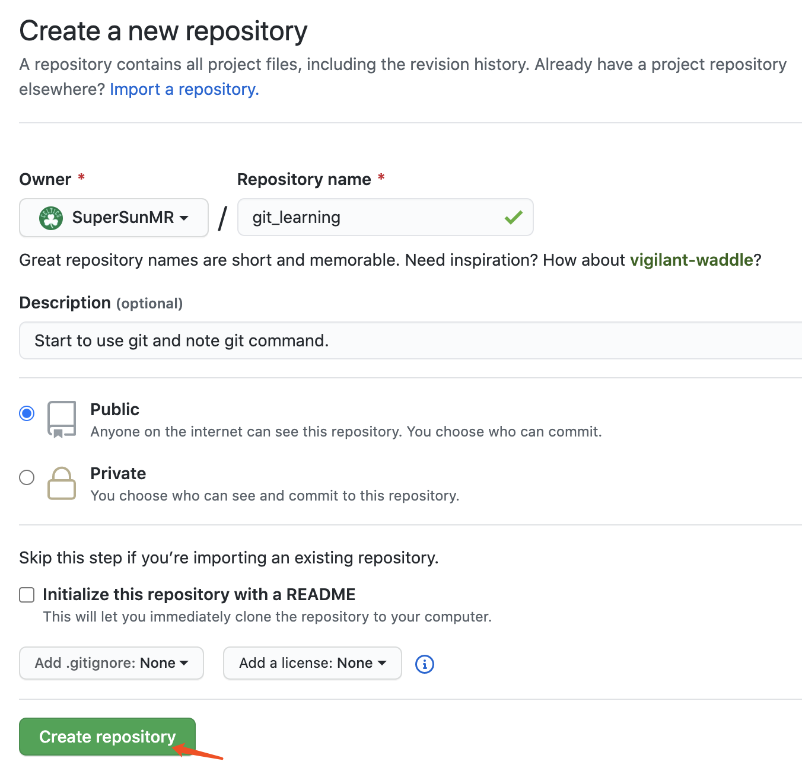
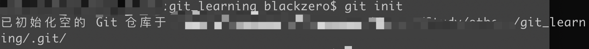
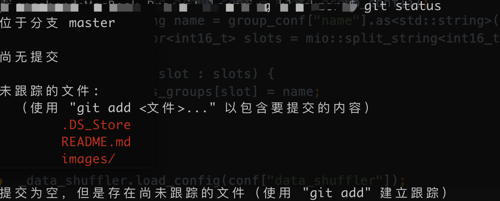
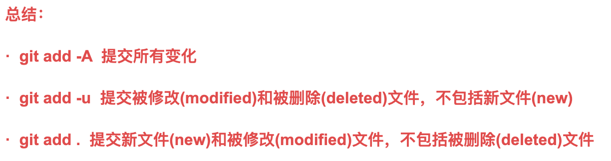
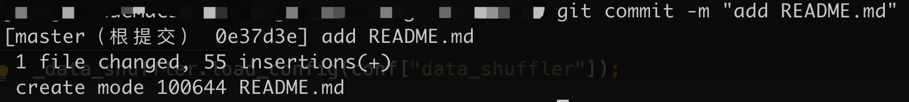
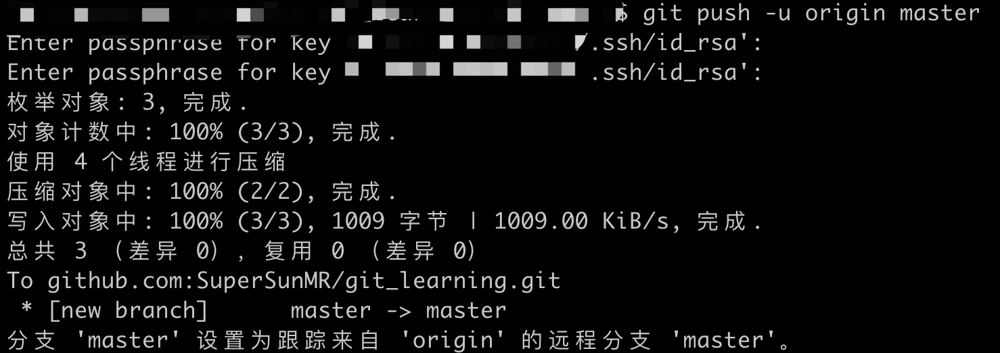
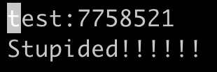
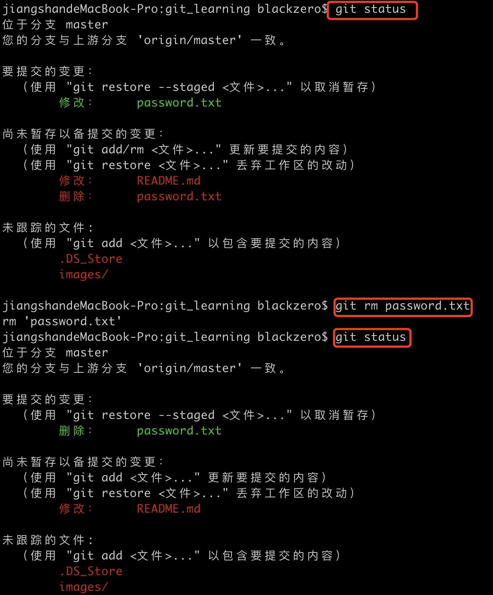

# 目录

[toc]

# 1. 创建仓库（repository）



# 2. 本地文件（或代码）准备

## 2.1 文件已经准备好的情况

如果你已经创建好仓库而且本地文件已经编写好，可以通过下面的步骤操作：

```bash
git init
git add README.md
git commit -m "first commit"
git remote add origin git@github.com:SuperSunMR/git_learning.git
git push -u origin master
```

## 2.2 从现有的仓库上继续编辑或开发

```bash
git clone git@github.com:SuperSunMR/git_learning.git
```

# 3. Git 各个区域

- 工作区：就是本地你存放文件、编辑代码的位置
- 暂存区：git add会把文件从工作区提交到暂存区
- 版本库：git init之后会在本地生成一个.git文件，这个文件就是版本库


# 4. 基本命令详解

1. ```bash
   git init
   ```

   将普通的工作区目录初始化为git目录

   

2. ```bash
   git status
   ```

   比较工作区和暂存区之间的文件内容差异

   

3. ```bash
   git add
   ```

   将工作区的内容文件提交到暂存区

   **git add . ：他会监控工作区的状态树，使用它会把工作时的**所有变化提交到暂存区，包括文件内容修改(modified)以及新文件(new)，但不包括被删除的文件。

   **git add -u** ：他仅监控**已经被add的文件**（即tracked file），他会将被修改的文件提交到暂存区。add -u 不会提交新文件（untracked file）。（git add --update的缩写）

   **git add -A** ：是上面两个功能的合集（git add --all的缩写）

   

4. ```bash
   git commit -m "说明信息"
   ```



5. ```bash
   git remote add origin git@github.com:SuperSunMR/git_learning.git
   ```

   将本地版本库与远程版本库链接

   

6. ```bash
   git push -u origin master
   ```

   将本地版本库提交到远程版本库

   加了参数-u后，以后即可直接用git push 代替git push origin master

   

7. ```bash
   git diff HEAD -- README.md
   ```

   

   这里把之前图片的绝对路径都改成了相对路径，因此git diff会比较工作区和版本库之间的文件差异。

   HEAD指向当前最新的版本库。

8. ```bash
   git checkout -- password.txt
   ```



​	在password.txt文件测试，原始文件只有第一行，现在加上下面一行。git checkout 可以撤销这个操作，即将工作区文件恢复到与版本库一致。git checkout的作用范围：

- 一种是password.txt自修改后**还没有被放到暂存区**，现在，撤销修改就回到和版本库一模一样的状态；
- 一种是password.txt**已经添加到暂存区后**，又作了修改，现在，撤销修改就回到添加到暂存区后的状态。


9. 删除文件

   - 一种情况是真的需要删除文件

   ```bash
   git rm password.txt
   ```

   如果在本地工作区删除了文件，如果远程的代码库也要删除，就用git rm 删除



- 如果在本地删除错了，可以用git checkout -- password.txt恢复到删除之前的状态

 ==注意：从来没有被添加到版本库就被删除的文件，是无法恢复的！==


# 5. 分支相关

todo