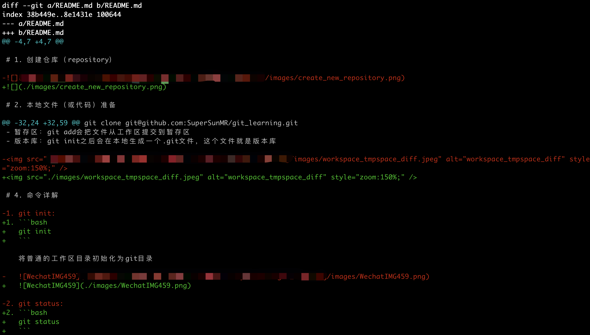

# 目录

[toc]

# 1. 创建仓库（repository）


# 2. 本地文件（或代码）准备

## 2.1 文件已经准备好的情况

如果你已经创建好仓库而且本地文件已经编写好，可以通过下面的步骤操作：

```bash
git init
git add README.md
git commit -m "first commit"
git remote add origin git@github.com:SuperSunMR/git_learning.git
git push -u origin master
```

## 2.2 从现有的仓库上继续编辑或开发

```bash
git clone git@github.com:SuperSunMR/git_learning.git
```

# 3. Git 各个区域

- 工作区：就是本地你存放文件、编辑代码的位置
- 暂存区：git add会把文件从工作区提交到暂存区
- 版本库：git init之后会在本地生成一个.git文件，这个文件就是版本库


# 4. 命令详解

1. ```bash
   git init
   ```

   将普通的工作区目录初始化为git目录

   

2. ```bash
   git status
   ```

   比较工作区和暂存区之间的文件内容差异

   

3. ```bash
   git add
   ```

   将工作区的内容文件提交到暂存区

4. ```bash
   git commit -m "说明信息"
   ```


5. ```bash
   git remote add origin git@github.com:SuperSunMR/git_learning.git
   ```

   将本地版本库与远程版本库链接

   

6. ```bash
   git push -u origin master
   ```

   将本地版本库提交到远程版本库

   加了参数-u后，以后即可直接用git push 代替git push origin master

   

7. ```bash
   git diff HEAD -- README.md
   ```

   

   这里把之前图片的绝对路径都改成了相对路径，因此git diff会比较工作区和版本库之间的文件差异。

   HEAD指向当前最新的版本库。